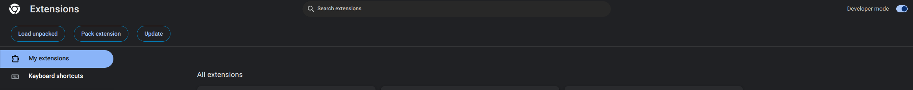
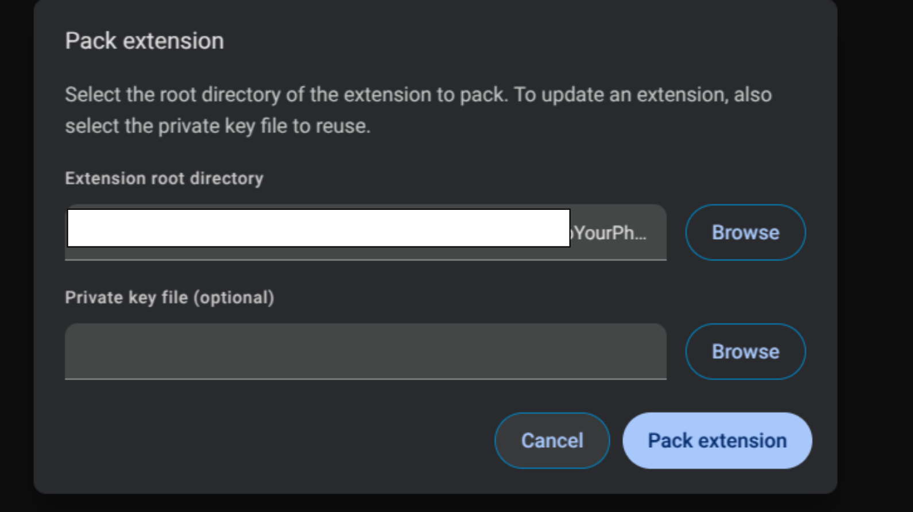
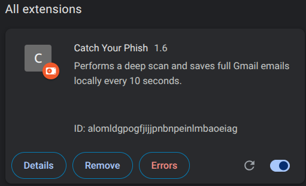

Projet d'Atelier Pratiques Cybersécurité 2 (8INF870) à l'UQAC.

## Présentation

Ce projet a pour but de permettre de sensibiliser et d'expliquer les emails de Phishing. Pour cela, les emails sont dans un premier temps analysé par des modèles de machine learning, puis dans un second temps, un algorithme d'intelligence artificielle explicatif (XAI) nommé LIME va retourner les mots clés ayant permis la catégorisation ainsi que la pondération de ces mots et enfin une explication claire et précise est réalisée par un LLM pour permettre à l'utilisateur d'apprendre à reconnaitre les emails de phishing et de détecter les différents indices permettant leurs détections.

Le schéma ci-dessous est un résumé du fonctionnement global de ce projet :

![doc/fonctionnement-global.png]


## Téléchargement du projet

Pour récupérer ce projet vous aurez besoin de l'outils git et de git lfs.

```bash
sudo apt-get update
sudo apt install git git-lfs
git clone https://github.com/godouxx/TrapYourPhish.git
cd TrapYourPhish/
git lfs pull
```

## Installation

> [!IMPORTANT]
> Pour le moment ce projet est uniquement fonctionnel sur un environnement Linux (une version docker est disponible pour les autres systèmes, son installation est détaillée plus bas)

Les étapes suivantes permettent de déployer & exécuter ce projet

### 0. Téléchargement des modèles

> [!IMPORTANT]
> Si ce n'est pas déjà fait, les modèles étant lourd ils ne sont pas stockés sur le projet git mais sur git lfs et doivent donc être récupérés depuis Git LFS.

```bash
sudo apt install git-lfs
git lfs pull
```

### 1. Création de l'environnement Python **(Minimum Python3.12)**

> [!NOTE]
> Pour cette étape, la présence de Python est supposé, sinon `sudo apt install python3 python3-venv python3-pip` permettra de l'installer sur une distribution dérivant de Debian (Ubuntu, Debian, Linux Mint...)

Dans un premier temps, le projet nécessite la création d'un environnement virtuel Python.

> [!CAUTION]
> L'environnement virtuel Python doit être créer à la racine du projet

```bash
python3 -m venv .venv
```

Puis installer les dépendances nécessaires :
```bash
source .venv/bin/activate
pip install -r requirements.txt
```

> [!IMPORTANT]
> Le programme Python doit être actif pour que l'analyse de l'email soit réalisable, la commande suivante permettra de lancer l'API flask nécessaire à l'analyse

```bash
.venv/bin/python3 ML/check-mail.py
```


### 2. Mise en place de la base de données

Une base de données MySQL ou MariaDB doit être mise en place pour sauvegarder les comptes utilisateurs et leur historique d'emails.

Dans un premier temps, un serveur MySQL ou MariaDB doit être installé :
```bash
sudo apt install mariadb-server
sudo systemctl start mariadb.service
```

> [!NOTE]
> Si vous souhaitez installer le serveur sur une autre machine, vous devez vérifier que les ports du serveur SQL sont bien ouverts

Dans un second temps, l'utilisateur et la base de donnée doivent être créés.
```bash
sudo mysql
```

```mysql
CREATE DATABASE trapyourphish DEFAULT CHARACTER SET utf8 COLLATE utf8_general_ci;
CREATE USER 'trapyourphish'@'%' IDENTIFIED BY 'SUPERPASSWORD';
GRANT USAGE ON *.* TO 'trapyourphish'@'%';
GRANT ALL PRIVILEGES ON trapyourphish.* TO 'trapyourphish'@'%';
FLUSH PRIVILEGES;
```

> [!CAUTION]
> Si votre base de données est sur une autre machine ou que vous avez modifié les configurations pour l'utilisateur / la base de données MySQL, vous devez modifier les identifiants dans le fichier de configuration pour le backend `Backend/config/default.json`.

### 3. Mise en place du backend / front-end

Le backend utilise le langage [Rust](https://www.rust-lang.org/), il est donc nécessaire de [l'installer](https://www.rust-lang.org/tools/install) 
L'installation standard est suffisante pour l'installation de rust pour notre projet:

```bash
sudo apt install curl
curl --proto '=https' --tlsv1.2 -sSf https://sh.rustup.rs | sh
source ~/.bashrc
```
Puis aller dans le répertoire Backend :
```bash
cd Backend
```

Et lancer le programme Rust :
```bash
cargo run -- --prod
```

> [!TIP]
> Si vous avez une erreur parlant de lib openssl manquante, il faudra installer le paquet suivant sous Ubuntu `sudo apt-get install libssl-dev pkg-config`

Ce programme devrait installer les dépendances nécessaires dans un premier temps, puis la ligne suivante devrait apparaitre:
```bash
2025-03-11T15:39:37.298327Z  INFO actix_server::server: starting service: "actix-web-service-0.0.0.0:8080", workers: 12, listening on: 0.0.0.0:8080
```

Signifiant que le serveur web est bien en cours d'exécution, vous pouvez vous rendre sur votre navigateur sur l'URL http://localhost:8080, qui vous permettra d'accéder à l'interface web du projet.

### 4. Mise en place de ollama

Pour expliquer la raison de pourquoi un email est un email de phishing, la
puissance des LLM est utilisé, et cela grâce à
[ollama](https://github.com/ollama/ollama) qui permet d'exploiter le maximum de
performances de la machine hôte.  
  
Pour l'installer, ollama propose un script:

```bash
curl -fsSL https://ollama.com/install.sh | sh
```

Puis ollama doit être lancer:

```bash
ollama serve
```
  
et dans un autre terminal:  
  
```bash
ollama pull artifish/llama3.2-uncensored
```  

> [!IMPORTANT]
> Il est nécessaire de modifier la variable `LLM_URL` dans le docker compose et de remplacer l'URL par celle de votre API ollama

> [!TIP]
> Si vous souhaitez utiliser Ollama pour un autre appareil, le port 11434 doit
> être ouvert et vous devrez définir une variable d'environnement `OLLAMA_HOST`
> à `0.0.0.0` avec la commande `export OLLAMA_HOST=0.0.0.0`  

> [!TIP]
>Si vous utilisez wsl vous pourrez retrouver l'IP de votre machine avec la commande `wsl hostname -I` et vous pourrez l'utiliser pour vous connecter à votre serveur ollama et par la suite changer l'URL dans le docker-compose.yaml dans la ligne `LLM_URL`.
## Docker

Pour des questions de simplicité de déploiement un dockerfile et un docker-compose sont disponibles pour ce projet.  

> [!IMPORTANT]
> Pour des questions de sécurité dans le cadre d'un déploiement en environnement de production, il peut être nécessaire de modifier des paramètres (mots de passes, nom d'utilisateur)

Pour l'utiliser, [docker](https://www.docker.com/) est nécessaire sur votre machine.
  
**Vous devez modifier le `docker-compose.yaml` et remplacer la ligne LLM_URL
dans `python-ml` avec l'URL de votre serveur ollama.**  
  
Les commandes suivantes permettront de déployer le projet via docker:

```bash
docker compose build
docker compose up -d
```

Normalement l'interface sera disponible sur http://localhost:8080

## Utilisation de l'interface web

Pour analyser un email, vous devez, dans un premier temps, créer un compte.  
Pour cela, vous pouvez soit cliquer sur l'icône de personnage en blanc (haut à droite de la barre de navigation) ou vous rendre sur l'URL http://localhost/auth/register  
Une fois votre compte créé, connectez-vous, puis vous pourrez accéder à la page d'analyse d'email (http://localhost:8080/predict) ou à l'historique (http://localhost:8080/history).

## Utilisation de l'extension Chrome

L'extension Chrome permet de récupérer les emails de votre boîte de réception et de les analyser directement depuis l'interface web. Elle va utiliser l'API du backend pour envoyer les emails et récupérer les résultats de l'analyse. Il permet également de vérifier si un utilisateur est connecté ou non afin de garantir par la suite que l'utilisateur a bien payé pour l'utilisation de l'application.

### Installation de l'extension

L'extension fonctionne uniquement sur Chrome et va scrapper les mails du service de messagerie Gmail. Il faut par la suite activer le mode développeur dans les paramètres de Chrome. Pour cela rendez-vous dans le menu des extensions (chrome://extensions/) et activez le mode développeur en haut à droite.


Ensuite, cliquez sur "Load unpacked" et sélectionnez le dossier contenant l'extension ici le sous dossier de ce répértoire nommé mail-scrap-extension.  


Une extension nommée "Catch Your Phish devrait apparaître dans la liste des extensions.


3 pages de l'extension sont disponibles:
- **Home**: Page d'accueil de l'extension, elle permet de se connecter à l'application web et de vérifier si l'utilisateur est connecté ou non.

- **Register**: Page d'inscription de l'extension, elle permet de créer un compte sur l'application web.
- **Dashboard**: Page de l'extension qui permet de récupérer les emails et par la suite de les envoyer au backend pour analyse. (GUI partiellement fait et liaison avec le backend pas encore faite)